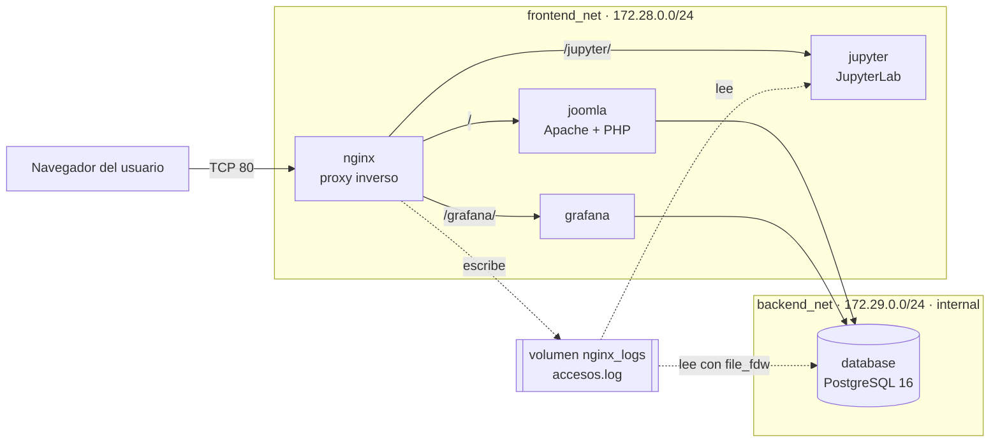

# Parcial 2 – Comunicaciones: infraestructura multi-contenedor con Docker Compose

**Estudiante:** Juan Chacon · Ingeniería Mecatrónica · Universidad Militar Nueva Granada (UMNG)
**Docente:** Ing. Andrés Julián Moreno M.Sc.

Despliegue de cinco servicios orquestados con Docker Compose: un **proxy inverso nginx** como única puerta de entrada, un **CMS Joomla** sobre **PostgreSQL 16**, un entorno **Jupyter** con un cuaderno de análisis precargado y **Grafana** con fuente de datos y tablero aprovisionados automáticamente. Todo el tráfico que pasa por nginx queda registrado en un log centralizado que analizan tanto Jupyter como Grafana.

---

## 1. Puesta en marcha

Requisitos: Docker Engine con el plugin Compose v2 (en Windows, Docker Desktop con WSL2) y el puerto 80 libre.

```bash
git clone <url-del-repositorio>
cd parcial-redes-comunicaciones
cp .env.example .env
docker compose up -d --build
docker compose ps
```

La primera ejecución descarga las imágenes, construye la imagen de Jupyter e instala Joomla automáticamente; tarda unos minutos. El sistema está listo cuando los cinco contenedores aparecen como `(healthy)`.

| Servicio | URL | Acceso |
|---|---|---|
| Joomla (sitio) | http://localhost/ | Público |
| Joomla (administración) | http://localhost/administrator | `admin` / `AdminParcial2026!` |
| Jupyter | http://localhost/jupyter/ | Token `parcial2026` |
| Grafana | http://localhost/grafana/ | Tablero visible sin iniciar sesión (rol Viewer). Admin: `admin` / `AdminGrafana2026!` |
| Salud del proxy | http://localhost/nginx-health | Devuelve `ok` |

Las credenciales son valores de prueba definidos en `.env.example`. El archivo `.env` real no se versiona (ver `.gitignore`).

Para detener todo: `docker compose down`. Para borrar además los datos y empezar desde cero: `docker compose down -v`.

---

## 2. Arquitectura



| Contenedor | Imagen | Redes | Puerto interno | Publicado |
|---|---|---|---|---|
| nginx | `nginx:alpine` | frontend_net | 80/tcp | **0.0.0.0:80** |
| joomla | `joomla:latest` | frontend_net, backend_net | 80/tcp | No |
| database | `postgres:16-alpine` | backend_net | 5432/tcp | No |
| jupyter | `parcial-jupyter:local` (Dockerfile propio) | frontend_net | 8888/tcp | No |
| grafana | `grafana/grafana:13.2.2` | frontend_net, backend_net | 3000/tcp | No |

**Decisiones de diseño principales:**

- **nginx es el único contenedor con puerto publicado.** Los demás solo son alcanzables dentro de las redes de Docker, así que el único punto de entrada desde el exterior es el proxy.
- **La base de datos vive sola en una red `internal: true`.** `backend_net` no tiene salida a internet ni es accesible desde el host; solo entran los servicios que necesitan datos (Joomla y Grafana). Jupyter no tiene acceso a la base.
- **Orden de arranque con healthchecks.** Joomla y Grafana esperan a que PostgreSQL esté `healthy` (`pg_isready`), y nginx espera a que existan sus destinos (nginx se niega a arrancar si un `proxy_pass` apunta a un nombre que no resuelve). Grafana tiene su propio healthcheck para que nginx no le envíe tráfico antes de que responda.
- **Todo se configura por código.** Joomla se autoinstala con variables de entorno; PostgreSQL ejecuta `database/init/01_logs_nginx.sql` al crearse; Grafana crea su fuente de datos y su tablero por *provisioning*. No hace falta ningún paso manual.

---

## 3. Estructura del repositorio

```
parcial-redes-comunicaciones/
├── docker-compose.yml                  # Orquestación de los 5 servicios, redes y volúmenes
├── .env.example                        # Plantilla de credenciales (copiar a .env)
├── .gitignore
├── nginx/
│   └── default.conf                    # Rutas del proxy, cabeceras y formato de log
├── database/
│   └── init/01_logs_nginx.sql          # file_fdw: expone accesos.log como vista SQL
├── jupyter/
│   ├── Dockerfile                      # minimal-notebook + pandas + matplotlib
│   └── notebooks/analisis_datos.ipynb  # Cuaderno precargado de análisis de tráfico
└── grafana/provisioning/
    ├── datasources/datasource.yml      # Conexión a PostgreSQL
    └── dashboards/
        ├── dashboards.yml              # Proveedor de tableros
        └── nginx_accesos.json          # Tablero de tráfico del proxy
```

**Volúmenes:** `db_data` (datos de PostgreSQL), `joomla_data` (archivos del sitio), `nginx_logs` (logs del proxy, compartido en solo lectura con Jupyter y PostgreSQL) y `grafana_data` (estado interno de Grafana). Además hay *bind-mounts* de la configuración del repositorio: `nginx/default.conf`, `database/init`, `jupyter/notebooks` y `grafana/provisioning`.

---

## 4. Flujo de los datos de monitoreo

1. **nginx** registra cada petición en `/var/log/nginx/accesos.log` con un formato propio separado por `|`:
   ```
   fecha|ip|servicio|metodo|uri|codigo|bytes|tiempo
   2026-09-28T02:20:53+00:00|172.28.0.1|jupyter|GET|/jupyter/api/kernels|200|160|0.002
   ```
   La variable `$servicio` se fija en cada `location`, así cada línea queda etiquetada con el servicio que atendió la petición.
2. El log se guarda en el volumen **`nginx_logs`**, montado en solo lectura en Jupyter (`/home/jovyan/logs/nginx`) y en PostgreSQL (`/logs/nginx`).
3. **Jupyter:** el cuaderno `analisis_datos.ipynb` lee el archivo con pandas, calcula totales por servicio, códigos HTTP y tiempos de respuesta, y genera gráficas de barras y de peticiones por minuto.
4. **PostgreSQL:** la extensión `file_fdw` presenta el archivo como la tabla externa `nginx_accesos_raw`, y la vista `nginx_accesos` convierte cada columna a su tipo (fecha, entero, numérico). El archivo se lee en cada consulta, así que los datos están siempre al día.
5. **Grafana** consulta esa vista por `backend_net` y muestra el tablero *"Tráfico del proxy nginx – Parcial 2"*, que se refresca cada 10 segundos: total de peticiones, errores 4xx/5xx, tiempo de respuesta, peticiones por minuto y servicio, peticiones por servicio, códigos HTTP y las últimas 20 peticiones.

---

## 5. Análisis por capas del modelo OSI

### Capas 1 y 2 – Física y enlace de datos

No hay cableado físico entre contenedores: la capa física se virtualiza. En Windows, Docker Desktop ejecuta los contenedores en una máquina virtual ligera de WSL2. Allí, cada red definida en el compose (`frontend_net`, `backend_net`) es un **bridge de Linux**, que funciona como un switch virtual. Cada contenedor se conecta a ese switch mediante un **par veth** (un "cable" virtual con un extremo dentro del contenedor, `eth0`, y el otro en el bridge) y recibe su propia **dirección MAC**. Los contenedores de una misma red se comunican a nivel de trama Ethernet a través del bridge; los que están en redes distintas no comparten dominio de difusión.

### Capa 3 – Red

- **Direccionamiento:** cada red tiene una subred fija para que el direccionamiento sea predecible: `frontend_net` = `172.28.0.0/24` y `backend_net` = `172.29.0.0/24`. La dirección `.1` de cada subred es la **puerta de enlace** (el bridge). Por eso en el log las peticiones que llegan desde Windows aparecen con origen `172.28.0.1`: el tráfico del host entra a la red de contenedores por esa puerta de enlace.
- **Aislamiento:** `backend_net` está declarada con `internal: true`. Docker no le crea ruta de salida ni NAT, así que la base de datos no puede alcanzar internet y tampoco es alcanzable desde el host. Los contenedores con dos redes (Joomla y Grafana) tienen una interfaz en cada subred y son los únicos que "ven" ambas.
- **Resolución de nombres:** Docker incluye un servidor DNS interno (`127.0.0.11`) que traduce el nombre de cada servicio a su IP. Por eso las configuraciones usan nombres y no direcciones: `proxy_pass http://joomla:80`, `JOOMLA_DB_HOST: database`, `url: database:5432`.

### Capa 4 – Transporte

Todos los servicios usan **TCP**: 80 (nginx y Apache de Joomla), 5432 (PostgreSQL), 8888 (Jupyter) y 3000 (Grafana). Solo el puerto 80 de nginx está **publicado** (`0.0.0.0:80->80/tcp`): Docker reenvía las conexiones que llegan al puerto 80 del host hacia el puerto 80 del contenedor nginx (redirección de puertos con NAT). Los demás puertos solo están *expuestos* dentro de las redes de Docker. nginx termina la conexión TCP del cliente y abre una conexión TCP nueva hacia el servicio de destino; el cliente nunca se conecta directamente con Joomla, Jupyter o Grafana.

### Capas 5 y 6 – Sesión y presentación

- **Sesión:** Jupyter (canal del kernel) y Grafana (actualizaciones en vivo, `/api/live/ws`) mantienen **sesiones persistentes por WebSocket**. nginx las conserva abiertas con `proxy_read_timeout 86400` para no cortar un kernel inactivo. Joomla y Grafana gestionan además sesiones de usuario con cookies.
- **Presentación:** los datos viajan como HTML, JSON (APIs de Jupyter y Grafana) y texto plano (log). El despliegue usa HTTP sin cifrar porque es un entorno local de laboratorio; en producción se añadiría TLS en nginx (HTTPS en el puerto 443), que es la capa donde se cifraría la información.

### Capa 7 – Aplicación

nginx actúa como **proxy inverso HTTP** y enruta por la ruta de la URL:

| Ruta | Destino |
|---|---|
| `/` | `joomla:80` |
| `/jupyter/` | `jupyter:8888` (Jupyter configurado con `base_url=/jupyter/`) |
| `/grafana/` | `grafana:3000` (Grafana con `serve_from_sub_path`) |
| `/nginx-health` | Respuesta directa de nginx (`200 ok`) |

Cabeceras que el proxy reenvía a cada servicio, porque de otro modo solo verían la IP y el nombre de nginx:

- `Host`: el dominio y puerto que escribió el usuario, para que la aplicación genere enlaces correctos.
- `X-Real-IP` y `X-Forwarded-For`: la IP real del cliente.
- `X-Forwarded-Proto`: el protocolo original (`http`/`https`).
- `Upgrade` y `Connection`: necesarias para el **HTTP Upgrade a WebSocket**. Estas cabeceras son *hop-by-hop* y un proxy no las reenvía por defecto, así que se pasan explícitamente; el bloque `map $http_upgrade $connection_upgrade` decide el valor de `Connection` según si el cliente pidió o no el cambio de protocolo.

**Códigos HTTP observados en el log y su significado:**

| Código | Significado en este despliegue |
|---|---|
| 200 / 204 | Respuestas correctas (204: la API de Jupyter guardando el espacio de trabajo, sin contenido) |
| 101 | *Switching Protocols*: la conexión pasó de HTTP a WebSocket (kernel de Jupyter) |
| 301 / 302 | Redirecciones (`/jupyter` → `/jupyter/`, páginas de inicio de sesión) |
| 304 | *Not Modified*: el navegador usó su copia en caché |
| 401 | Petición sin autenticación (visitante anónimo de Grafana consultando favoritos) |
| 404 | Recurso inexistente (pruebas a `/noexiste`, o un kernel de Jupyter que ya no existe) |
| 499 | Código propio de nginx: el cliente cerró la conexión antes de recibir la respuesta |
| 502 | *Bad Gateway*: nginx recibió la petición pero el servicio de destino aún no respondía (arranque de Grafana; se evitó con el healthcheck) |

---

## 6. Verificación rápida

```bash
docker compose ps                                   # 5 contenedores (healthy)
curl -s http://localhost/nginx-health               # ok
curl -s http://localhost/grafana/api/health         # "database": "ok"
docker exec nginx tail -n 5 /var/log/nginx/accesos.log
docker exec database psql -U joomla_user -d joomla_db \
  -c "SELECT servicio, status, count(*) FROM nginx_accesos GROUP BY 1, 2 ORDER BY 1, 2;"
docker compose logs database | grep 01_logs_nginx   # el script de inicio se ejecutó solo
```

Comprobación del aislamiento: la base de datos no tiene salida a internet.

```bash
docker exec database ping -c 1 -W 2 8.8.8.8         # debe fallar
```